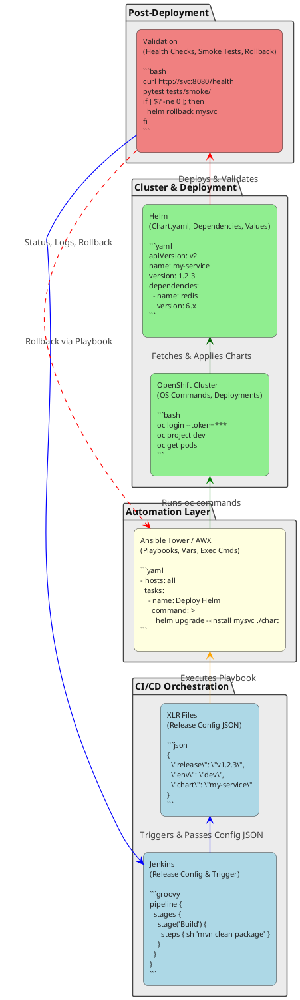

Great 👍 Let me give you both **PlantUML** and **Mermaid** snippets so you can render in any tool you like.

---

## 🌱 **PlantUML Version**

```plantuml
@startuml
skinparam style strict
skinparam shadowing false
skinparam rectangle {
  BackgroundColor #F9F9F9
  BorderColor #333
  RoundCorner 15
  FontSize 11
  FontColor #222
}
skinparam package {
  BackgroundColor #ECECEC
  BorderColor #444
  FontColor #111
  FontStyle bold
}
skinparam arrow {
  Thickness 1.2
  Color #444
  FontColor #444
}

left to right direction

package "CI/CD Orchestration" {
  rectangle "Jenkins\n(Release Config & Trigger)\n\n```groovy\npipeline {\n  stages {\n    stage('Build') {\n      steps { sh 'mvn clean package' }\n    }\n  }\n}\n```" as Jenkins #LightBlue

  rectangle "XLR Files\n(Release Config JSON)\n\n```json\n{\n  \"release\": \"v1.2.3\",\n  \"env\": \"dev\",\n  \"chart\": \"my-service\"\n}\n```" as XLR #LightBlue
}

package "Automation Layer" {
  rectangle "Ansible Tower / AWX\n(Playbooks, Vars, Exec Cmds)\n\n```yaml\n- hosts: all\n  tasks:\n    - name: Deploy Helm\n      command: >\n        helm upgrade --install mysvc ./chart\n```\n" as Ansible #LightYellow
}

package "Cluster & Deployment" {
  rectangle "OpenShift Cluster\n(OS Commands, Deployments)\n\n```bash\noc login --token=***\noc project dev\noc get pods\n```\n" as OpenShift #LightGreen

  rectangle "Helm\n(Chart.yaml, Dependencies, Values)\n\n```yaml\napiVersion: v2\nname: my-service\nversion: 1.2.3\ndependencies:\n  - name: redis\n    version: 6.x\n```\n" as Helm #LightGreen
}

package "Post-Deployment" {
  rectangle "Validation\n(Health Checks, Smoke Tests, Rollback)\n\n```bash\ncurl http://svc:8080/health\npytest tests/smoke/\nif [ $? -ne 0 ]; then\n  helm rollback mysvc\nfi\n```\n" as Validation #LightCoral
}

' Horizontal flow arrows
Jenkins -[#blue]> XLR : "Triggers & Passes Config JSON"
XLR -[#orange]> Ansible : "Executes Playbook"
Ansible -[#green]> OpenShift : "Runs oc commands"
OpenShift -[#darkgreen]> Helm : "Fetches & Applies Charts"
Helm -[#red]> Validation : "Deploys & Validates"
Validation -[#blue]> Jenkins : "Status, Logs, Rollback"
Validation -[#red,dashed]-> Ansible : "Rollback via Playbook"

@enduml
<img width="732" height="1088" alt="image" src="https://github.com/user-attachments/assets/589bb276-4d7c-4dc0-ad69-1108bad0f709" />

```

