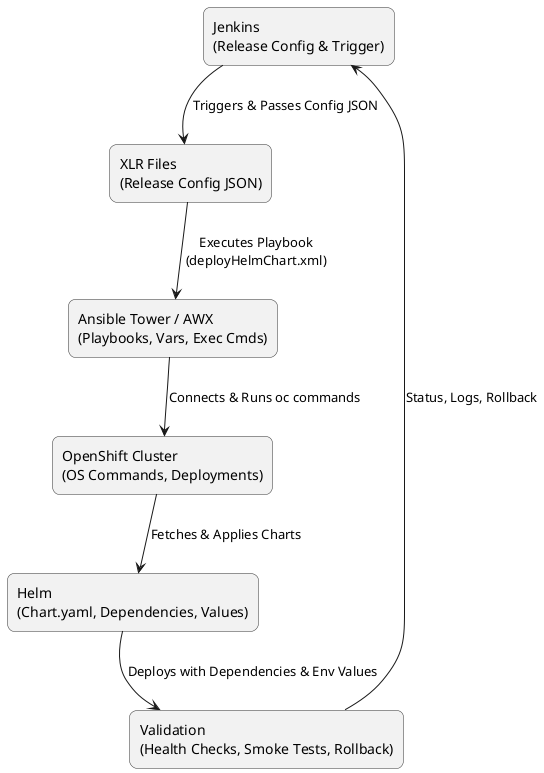

Great 👍 Let me give you both **PlantUML** and **Mermaid** snippets so you can render in any tool you like.

---

## 🌱 **PlantUML Version**



---

## 🐋 **Mermaid Version**

```mermaid
flowchart LR
    Jenkins[Jenkins\n(Release Config & Trigger)]
    XLR[XLR Files\n(Release Config JSON)]
    Ansible[Ansible Tower / AWX\n(Playbooks, Vars, Exec Cmds)]
    OpenShift[OpenShift Cluster\n(OS Commands, Deployments)]
    Helm[Helm\n(Chart.yaml, Dependencies, Values)]
    Validation[Validation\n(Health Checks, Smoke Tests, Rollback)]

    Jenkins -->|Triggers & Passes Config JSON| XLR
    XLR -->|Executes Playbook\ndeployHelmChart.xml| Ansible
    Ansible -->|Connects & Runs oc commands| OpenShift
    OpenShift -->|Fetches & Applies Charts| Helm
    Helm -->|Deploys with Dependencies & Env Values| Validation
    Validation -->|Status, Logs, Rollback| Jenkins
```

---

⚡ You can copy-paste these into:

* **PlantUML** → IntelliJ plugin, VSCode PlantUML extension, or web renderer.
* **Mermaid** → Markdown previewers, GitHub, GitLab, or `mermaid.live`.

👉 Do you want me to **add environment-specific paths** (like `values-env1.yaml`, `values-env2.yaml`) into the diagram as subnodes under Helm for clarity?
