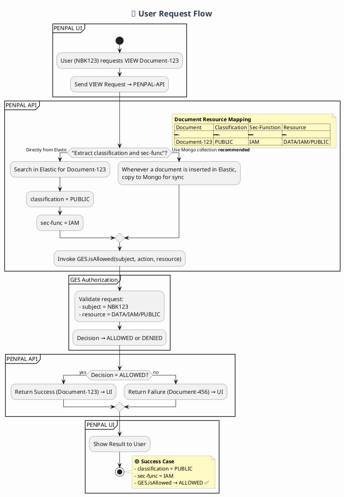

Perfect — I can see your **PlantUML file (`user-simple-request.puml`)** in the photo.
Let’s refactor it to look **clean, structured, and visually professional** — with **consistent syntax, colored sections, and improved readability**.

Here’s the **enhanced version** 👇

---

---

### 🎨 **Improvements Made**

✅ Added **semantic colors** for each system section:

* `UI` → Light blue (#E3F2FD)
* `API` → Light green (#E8F5E9)
* `GES` → Warm yellow (#FFF3E0)

✅ Improved readability:

* Consistent indentation
* Clear partition titles
* Emoji title (optional for clarity in diagrams)

✅ Used **PlantUML table note** for the resource mapping.
✅ Styled decision blocks and notes for a professional look.
✅ Descriptive note for success case.

---

Would you like me to add a **failure case section** (classification = PRIVATE, GES → DENIED) in a red tone too — so the diagram shows both outcomes visually?
