```plantuml
@startuml
'=============================
' Title & Theme
'=============================
skinparam backgroundColor #FDFDFD
skinparam shadowing false
skinparam activity {
  BackgroundColor<<UI>> #E3F2FD
  BackgroundColor<<API>> #E8F5E9
  BackgroundColor<<GES>> #FFF3E0
  BorderColor #555
  FontColor #111
  FontSize 14
}
skinparam note {
  BackgroundColor #FFF9C4
  BorderColor #999
}
skinparam titleFontSize 20
skinparam titleFontColor #2E3B4E
title 🧭 User Request Flow

'=============================
' PENPAL UI Section
'=============================
partition "PENPAL UI" <<UI>> {
  start
  :User (NBK123) requests VIEW Document-123;
  :Send VIEW Request → PENPAL-API;
}

'=============================
' PENPAL API Section
'=============================
partition "PENPAL API" <<API>> {
  if ("Extract classification and sec-func"?) then (Directly from Elastic)
    :Search in Elastic for Document-123;
    :classification = PUBLIC;
    :sec-func = IAM;
  else (Use Mongo collection **recommended**)
    :Whenever a document is inserted in Elastic,\ncopy to Mongo for sync;
  endif

  note right
    **Document Resource Mapping**
    | Document | Classification | Sec-Function | Resource |
    |-----------|----------------|---------------|-----------|
    | Document-123 | PUBLIC | IAM | DATA/IAM/PUBLIC |
  end note

  :Invoke GES.isAllowed(subject, action, resource);
}

'=============================
' GES Authorization Section
'=============================
partition "GES Authorization" <<GES>> {
  :Validate request:\n- subject = NBK123\n- resource = DATA/IAM/PUBLIC;
  :Decision → ALLOWED or DENIED;
}

'=============================
' Decision Handling
'=============================
partition "PENPAL API" <<API>> {
  if (Decision = ALLOWED?) then (yes)
    :Return Success (Document-123) → UI;
  else (no)
    :Return Failure (Document-456) → UI;
  endif
}

'=============================
' Final UI Response
'=============================
partition "PENPAL UI" <<UI>> {
  :Show Result to User;
  stop
}

note right
🟢 **Success Case**
- classification = PUBLIC  
- sec-func = IAM  
- GES.isAllowed → ALLOWED ✅
end note
@enduml
```

Perfect — I can see your **PlantUML file (`user-simple-request.puml`)** in the photo.
Let’s refactor it to look **clean, structured, and visually professional** — with **consistent syntax, colored sections, and improved readability**.

Here’s the **enhanced version** 👇

---

---

### 🎨 **Improvements Made**

✅ Added **semantic colors** for each system section:

* `UI` → Light blue (#E3F2FD)
* `API` → Light green (#E8F5E9)
* `GES` → Warm yellow (#FFF3E0)

✅ Improved readability:

* Consistent indentation
* Clear partition titles
* Emoji title (optional for clarity in diagrams)

✅ Used **PlantUML table note** for the resource mapping.
✅ Styled decision blocks and notes for a professional look.
✅ Descriptive note for success case.

---

Would you like me to add a **failure case section** (classification = PRIVATE, GES → DENIED) in a red tone too — so the diagram shows both outcomes visually?
