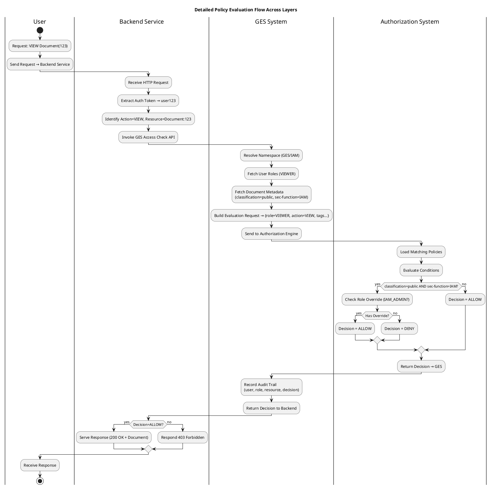

Excellent — you’re now asking for a **cross-system policy evaluation flow**, that shows **how authorization decisions propagate across three layers**:

1. **GES System (Governance Enforcement System)** – the logical policy and role hierarchy
2. **Backend Service** – API or application that enforces access
3. **Authorization System** – engine (like OPA / XACML / ABAC) that evaluates policies

---

Below is a **comprehensive step-by-step flow** in both **Mermaid** and **PlantUML**, showing how a request (user → backend → GES → authorization engine → decision) travels, is evaluated, and results in an allow/deny.

---

## 🧩 Mermaid Version (Cross-System Flow)

```mermaid
flowchart TD
    %% ==== User Layer ====
    U[👤 User / Client\nRequests: VIEW Document(ID:123)] --> B1

    %% ==== Backend Service Layer ====
    subgraph Backend_Service ["🖥️ Backend Service (API Gateway / App Server)"]
        B1[Receive Request\n(Headers, Auth Token)] --> B2[Extract User Identity\nfrom Token (user123)]
        B2 --> B3[Determine Action + Resource\n(View, /documents/123)]
        B3 --> B4[Call GES System for Access Check\n(Policy Validation Request)]
    end

    %% ==== GES Layer ====
    subgraph GES_System ["🧩 GES System\n(Namespace → Roles → Actions → Resources)"]
        G1[Lookup Namespace Context\n(e.g., GES → IAM domain)]
        G2[Resolve User Roles\n(user123 → VIEWER)]
        G3[Fetch Resource Metadata\n(classification=public,\nsec-function=IAM)]
        G4[Construct Policy Evaluation Request\n(role=VIEWER, action=VIEW,\nmetadata=tags)]
        G1 --> G2 --> G3 --> G4 --> A1
    end

    %% ==== Authorization Engine Layer ====
    subgraph Auth_System ["🧠 Authorization Engine\n(ABAC / OPA / XACML)"]
        A1[Receive Policy Evaluation Request]
        A2[Retrieve Matching Policies\n(Role=VIEWER, Action=VIEW, Resource=DATA/*)]
        A3[Evaluate Policy Conditions]
        A4{Condition: classification=public\nand sec-function=IAM?}
        A4 -->|Yes| A5[Check Role Overrides\n(IAM_ADMIN?)]
        A4 -->|No| A6[Decision = ALLOW]
        A5 -->|Override Found| A6
        A5 -->|No Override| A7[Decision = DENY]
    end

    %% ==== Return Path ====
    A6 --> G5[Return Decision = ALLOW ✅]
    A7 --> G5[Return Decision = DENY ❌]
    G5 --> B5[GES Returns Policy Decision to Backend]
    B5 -->|ALLOW| B6[Serve Document Response (200 OK)]
    B5 -->|DENY| B7[Return 403 Forbidden]
    B6 --> U
    B7 --> U

    %% ==== Audit ====
    subgraph Audit_Log ["📜 Audit / Monitoring"]
        A8[Log Evaluation Details\n(user, role, resource, tags, decision)]
    end
    A6 --> A8
    A7 --> A8

    %% ==== Styling ====
    classDef layer fill:#f0f8ff,stroke:#333,stroke-width:1px
    classDef backend fill:#e9f6f6,stroke:#333
    classDef ges fill:#fff4e6,stroke:#333
    classDef auth fill:#fefee0,stroke:#333
    classDef audit fill:#eeeeee,stroke:#333

    class Backend_Service backend
    class GES_System ges
    class Auth_System auth
    class Audit_Log audit
```

---

## 🧭 PlantUML Version (Enterprise-Style, Layered Swimlane)



---

## 🧠 Explanation of Each Layer

| Layer                    | Responsibility                | Key Operations                                                                                   |
| ------------------------ | ----------------------------- | ------------------------------------------------------------------------------------------------ |
| **GES System**           | Authorization abstraction     | Defines `Namespace → Roles → Action → Resource` hierarchy; fetches metadata and maps user → role |
| **Backend Service**      | Application logic             | Delegates authorization to GES, enforces the final ALLOW/DENY                                    |
| **Authorization Engine** | Policy logic (OPA/XACML/ABAC) | Evaluates contextual rules based on document metadata, role, and classification                  |
| **Audit System**         | Traceability                  | Records all policy evaluation results, metadata, and rule decisions                              |

---

## 🧩 Example Evaluation (IAM Document)

| Attribute         | Value                                                |
| ----------------- | ---------------------------------------------------- |
| User Role         | VIEWER                                               |
| Resource Metadata | `{classification: public, sec-function: IAM}`        |
| Policy            | `Deny if classification=public AND sec-function=IAM` |
| Result            | **DENY** (unless override IAM_ADMIN)                 |

---

Would you like me to extend this with **OpenShift integration flow** (showing how these layers map to OpenShift RBAC and service account tokens)?
That would help you align this authorization flow with your **deployment and access control model**.
